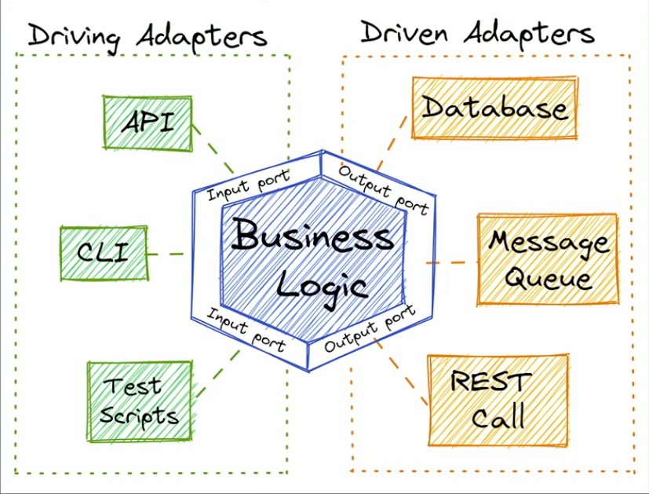
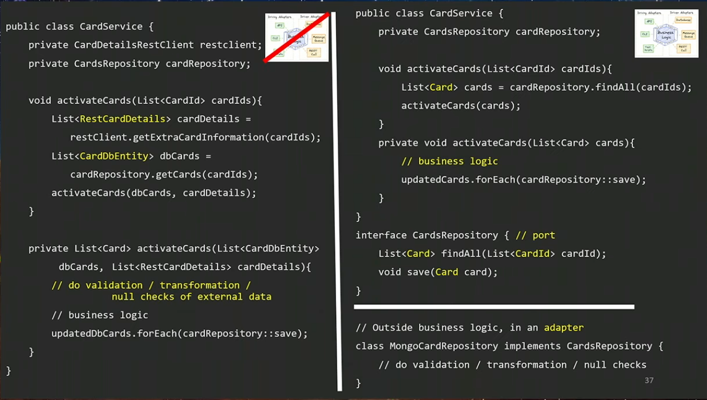

# Clean code
## Isolate business logic with technical details
Technical details are:
- Calling: database, third-party
- Receiving: REST API, Event

Example:

## Value Object
If we have some value (e.g String, Integer, etc), instead of validating it everytime the value is used, 
we should create an object for it and put the validation code inside\
Principle: Make something implicit explicit

